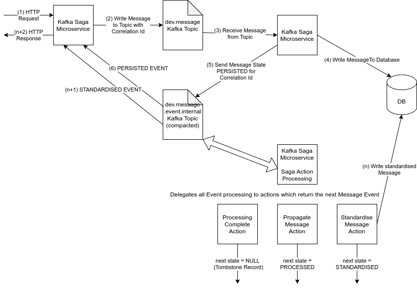
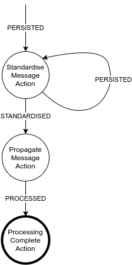

# KafkaSaga Application
Application spike that uses Kafka + Orchestration style Saga processing to break
complex transactions into simple steps using a simple State Machine

## Getting Started

### Trying it out
You can spin up the entire application using:

```bash
make start
```

This will bring up the following:
* Zookeeper service
* Kafka service
* Postgres DB service
* 4 KafkaSaga instances

#### Sending a http request to the microservice
```http request
POST http://localhost:8181/v1/message
Content-Type: application/json
Accept: application/json

{
	"source": "source",
	"destination": "kafkasaga1",
	"message": "Simple message sent to the first kafka saga microservice"
}
```
The other three servers are running on ports 8182, 8183 and 8184

#### How the kafka saga microservice works


The Kafka Saga instances use Kafka to transport Messages and manage MessageEvents, any Messages received
are persisted into the Postgres Database.

#### Kafka topics and message flow


The message flow is:
1. KafkaSaga instance receives HTTP request containing a new Message
2. The message is written to the `dev.message` kafka topic
3. A (potentially new) KafkaSaga instance receives the message from the `dev.message` kafka topic
4. The message is written to the DB
5. A MessageEvent is published to `dev.message.event.internal` kafka topic with a status of PERSISTED
6. The PERSISTED event is sent to all Kafka instances and is ignored
7. The PERSISTED event is sent to a (potentially new) KafkaSaga `MessageEventHandler` which delgates the
work to the `StandardiseMessageAction` class
8. (n) The message is standardised written to the database
9 The `StandardiseMessageAction` class returns a new MessageEvent with a status of STANDARDISED
10. (n+1) The STANDARDISED event is sent to all KafkaSaga instances and the one that handled the http request
loads the standardised message from the Database
11. (n+2) The KafkaSaga instance returns the http response to the caller
12. The STANDARDISED event is sent to the KafkaSaga `MessageEventHandler` which delegates the 
work to the `PropagateMessageAction` class
13. The message is propagated to other external systems
14. The `PropagateMessageAction` class returns a new MessageEvent with a status of PROPAGATED
15. The PROPAGATED event is sent to all KafkaSaga instances and is ignored
16. The PROPAGATED event is sent to the KafkaSaga `MessageEventHandler` which delegates the
work to the `ProcessingCompleteAction` class
17. Any cleanup work is performed after processing finishes
18. The `ProcessingCompleteAction` class returns a new MessageEvent with a status of PROCESSED
19. `MessageEventHandler` writes a tombstone record into `dev.message.event.internal`

#### Saga State Machine
The saga is represented as a simple state machine where message events are sent to Actions that process
them and return a new message event with a potentially different state.

This approach allows failures in Kafka, the Database or KafkaSaga instances to be recoverable. For example
if a KafkaSaga instance crashes halfway through processing a MessageEvent when the Kafka broker detects it
has failed the topic partitions will be reallocated between the remaining KafaSaga instances and the MessageEvent
will be redelivered and reprocessed.




### Local Development
Before the application can be run it needs a local kafka and postgres database running - this can be done
using docker:

```bash
make start-dev
```

This will start all the services (kafka, zookeeper and postgres)
- Kafka should be available on localhost:9092
- Zookeeper should be available on localhost:2181
- Postgres should be available on localhost:5432

### Accessing the database
In a separate terminal you can access the database to make sure it is working:
```bash
make db-terminal
```
You can open a SQL terminal using:
```bash
psql --host=database --username=admin --dbname=messages
```
The password when prompted is `password`
```sql
SELECT * FROM Message;
```
Can be run after the application has started.

## Running the application
```bash
make run
```

## Running Servers in parallel

### Build the application
```bash
./gradlew build
```

### Start Application Instances (different terminal for each command)
```bash
INSTANCE_ID=1 && java -jar build/libs/KafkaSaga-0.0.1-SNAPSHOT.jar --server.port=8181
INSTANCE_ID=2 && java -jar build/libs/KafkaSaga-0.0.1-SNAPSHOT.jar --server.port=8182
INSTANCE_ID=3 && java -jar build/libs/KafkaSaga-0.0.1-SNAPSHOT.jar --server.port=8183
INSTANCE_ID=4 && java -jar build/libs/KafkaSaga-0.0.1-SNAPSHOT.jar --server.port=8184
```
